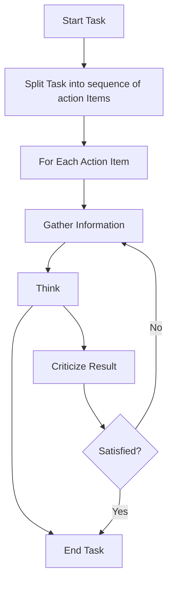

## Concept - Deep Research agent

Overall idea, 
To perform any tasks successfully, we need to perform the following:

```mermaid
flowchart TD
    A[Start Task] --> B[Split Task into sequence of action Items]
    B --> C[For Each Action Item]
    C --> D[Gather Information]
    D --> E[Think]
    E --> H[Attempt the task]
    E --> F[Criticize Result]
    F --> G{Satisfied?}
    G -->|Yes| H[End Task]
    G -->|No| D
```

What tasks can it perform?

